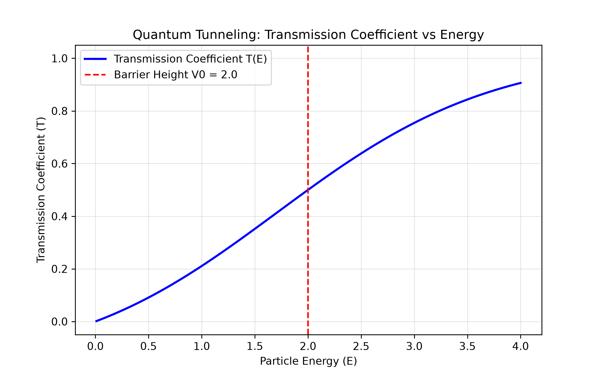
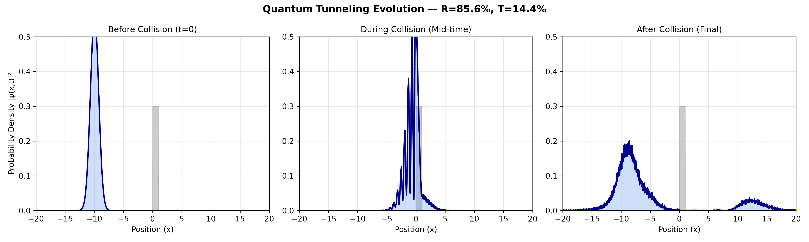

# Quantum Tunneling Simulation

A Python-based computational physics project simulating **quantum tunneling** — the phenomenon where a particle penetrates a potential energy barrier that it classically should not be able to cross. This project numerically solves the time-dependent Schrödinger equation using the **Split-Step Fourier Method** to visualize wave packet evolution and calculates transmission/reflection probabilities.

## 🔬 Physics Background

In classical mechanics, a particle without sufficient energy cannot cross a potential barrier — it simply bounces back. Quantum mechanics predicts something remarkable: due to the wave-like nature of particles, there is a **non-zero probability** that the particle "tunnels" through the barrier, even when its energy is less than the barrier height (E < V₀).

This phenomenon underpins real-world applications including:
- Nuclear fusion in stars
- Radioactive alpha decay
- Scanning Tunneling Microscopes (STM)
- Tunnel diodes in electronics

## 📊 Project Components

### 1. Transmission Coefficient Analysis (`transmission_coefficient.py`)
Calculates the theoretical transmission coefficient T(E) as a function of particle energy for a rectangular potential barrier, using the analytical solution derived from the time-independent Schrödinger equation.

### 2. Wave Packet Time Evolution (`wave_packet_animation.py`)
Simulates a Gaussian wave packet approaching a potential barrier over time, using the **Split-Step Fourier Method** to solve the time-dependent Schrödinger equation numerically.

### 3. Full Analysis with Statistics (`quantum_tunneling_full_analysis.py`)
Complete simulation including:
- Reflection Probability (R) and Transmission Probability (T) calculation
- Verification that R + T ≈ 1 (probability conservation)
- Multi-panel before/during/after collision snapshots
- Animated GIF generation

## 🖼️ Results

### Transmission Coefficient vs Energy

### Wave Packet Evolution Snapshots

With barrier height V₀ = 15.0 and incident wave packet momentum k₀ = 5.0:
- **Reflection Probability R ≈ 85.6%**
- **Transmission Probability T ≈ 14.4%**

This confirms that even when the particle's energy is insufficient to classically cross the barrier, quantum mechanics allows a measurable probability of transmission — direct numerical evidence of quantum tunneling.

## 🛠️ Technologies Used

- **Python 3.12**
- **NumPy** — numerical array operations and FFT
- **SciPy** — scientific computation
- **Matplotlib** — visualization and animation

## ⚙️ Methodology

The time-dependent Schrödinger equation is solved using the **Split-Step Fourier Method**:

1. The wave function is evolved in position space under the potential operator for a half time-step
2. Fourier transformed into momentum space
3. Evolved under the kinetic energy operator for a full time-step
4. Inverse Fourier transformed back to position space
5. Evolved under the potential operator for the remaining half time-step

This approach efficiently and accurately propagates the wave function while alternating between position and momentum space representations.

## 🚀 How to Run

1. Clone this repository:
git clone https://github.com/mohammedriyaz840/quantum-tunneling-simulation.git
2. Install dependencies:
pip install numpy scipy matplotlib
3. Run any of the simulation scripts:
python quantum_tunneling_full_analysis.py

## 📈 Future Improvements

- Extend simulation to 2D and 3D potential barriers
- Add interactive sliders (using ipywidgets) to adjust barrier height/width in real time
- Compare multiple barrier shapes (triangular, parabolic)
- Implement finite difference method as an alternative solver for validation

## 👤 Author

**Mohammed Riyaz**
MSc Physics
[GitHub Profile](https://github.com/mohammedriyaz840)

## 📄 License

This project is open source and available for educational use.
